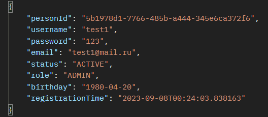
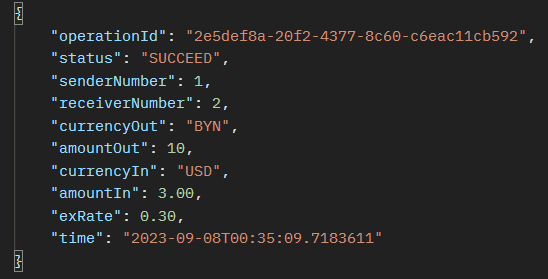
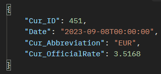

# d-Money
***
The service allows you to create an account and wallets in various currencies.
It also makes it possible to transfer funds to other accounts, and replenish wallets and withdraw funds. 
All payments are made in Belarusian rubles, so all currencies are converted into rubles and back.
Exchange rates are taken from the official API of the National Bank of the Republic of Belarus.
***
### Table Of Contents
* [Description & demonstration](#description--demonstration)
* [Technologies](#technologies)
* [To do](#to-do)
* [Contact me](#contact-me)
***
### Description & demonstration
It is possible to create an account using the following endpoint:  
POST http://localhost:8080/api/v1/person  
JSON body:  
{  
"username": "test",  
"password": "123",  
"email": "test@mail.ru",  
"status": "ACTIVE",  
"role": "ADMIN",  
"birthday": "1980-04-20"  
}  
A response will be received in JSON format:  
  
The same will happen with wallets and transactions. For example, after completing a transaction,
you will receive the following response:  
  
It is possible to obtain information about all users,
wallets and transactions using the following endpoints:  
GET http://localhost:8080/api/v1/persons  
GET http://localhost:8080/api/v1/wallets  
GET http://localhost:8080/api/v1/operations  

And if you want to receive information about any currency in the world directly from the National Bank,
you should use the following endpoints:  
GET http://localhost:8080/api/v1/currency/eur  
GET http://localhost:8080/api/v1/currency/usd  
  
And this is not all the capabilities of the service.
You can read more in the documentation of specific services!
### Technologies
* Java 17
* Hibernate
* MySQL
* Springboot
* Spring boot test, JUnit, AssertJ, Mockito
* Maven
### To do
* Add integration tests, JPA tests
* Add Spring Security
* Add business methods that allow operations to be completed in a given time
* Add functionality, transaction report sent to the client’s email
* etc.
### Contact me
heretic604@gmail.com
